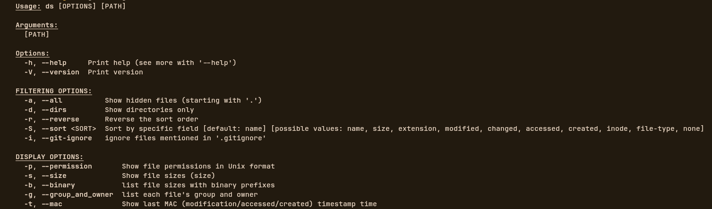

# ds - A modern directory lister

[](https://opensource.org/licenses/MIT)

`ds` (Directory List) is a fast, modern replacement for the `ls` command, written in Rust. It provides colorful output, additional file information, and customizable display options while maintaining compatibility with traditional `ls` usage patterns.



## Features

- 🎨 **Colorful output** with syntax highlighting for different file types
- 📊 **Multiple display formats**: permissions, sizes, timestamps, owners
- 🔍 **Advanced filtering**: show hidden files, directories only, respect .gitignore
- 🔄 **Flexible sorting**: by name, size, extension, timestamps, etc.
- ⚡ **Blazing fast** - written in Rust for maximum performance
- 📁 **Simple installation** - single binary with no dependencies

## Installation

### From source (requires Rust toolchain)
```bash
$ cargo install --git https://github.com/Mr-Fox-h/ds 
```
